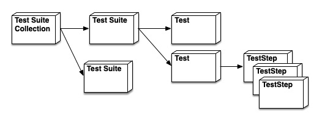

# Test Phases and Lifecycle

## Table of Contents

* [Summary](#summary)
    * [Goals](#goals)
    * [Non-Goals](#non-goals)
    * [Testing Focus](#testing-focus)
    * [Current Challenges](#current-challenges)
      * [Control Plane and TestSuite](#control-plane-and-testsuite)
      * [Flat TestSuites](#flat-testsuites)
* [Proposal](#proposal)
    * [Proposal: Component Definition](#proposal-component-definition)
    * [Proposal: Control Files](#proposal-control-files)
    * [Proposal: Component Types](#proposal-component-types)
    * [Proposal: Component Lifecycle](#proposal-component-lifecycle)
    * [Proposal: Component Lifecycle hooks](#proposal-component-lifecycle-hooks)
      * [Example TestSuite Collection with Lifecycle hooks](#example-testsuite-collection-with-lifecycle-hooks)
* [Alternatives](#alternatives)
    * [Proposal Maintain TestSuite for Collection and Suites](#proposal-maintain-testsuite-for-collection-and-suites)
* [KEP History](#kep-history)

## Summary

KUTTL would benefit from defining different phases of the test lifecycle along with setting expectations of lifecycle hooks for end users.  This is similar to a large number of test frameworks.  Using JUnit as an example, phases are well defined and there are meaningful lifecycle hooks such as `@BeforeAll`, `@AfterAll`, `@BeforeEach` and `@AfterEach`, along with setup and teardown.  This KEP takes on the effort of defining the different test phases and their lifecycles, the lifecycle hooks and how to configure them.


### Goals

* Define test phases
* Define expected life-cycle and order of phases
* Define the expected life-cycle hooks
* Define how to configure life-cycle hooks
* Separate control plane configuration from TestSuite configuration

### Non-Goals

* Integration with other testing ideologies and technologies
* Cluster creation beyond current KinD integration

### Testing Focus

KUTTL is used for many different purposes.  It can be used for "integration" tests with a mock control plane.  It can be used to run a series of tests which are not portable and is not intended to be.  It can be used to setup and verify a specific configuration of a cluster.  The focus on this KEP is around End to End (e2e) testing in a portable way.  While focusing on e2e, the functionality supporting the other uses should not be diminished. 

### Current Challenges

#### Control Plane and TestSuite

Today KUTTL's TestSuite configuration file provides 2 discreet functions:

1. Test Harness control of KUTTL start with default configurations.  This includes which control plane to use, the number of concurrent tests and the location of TestSuites.
2. TestSuite control which includes; applying manifests, CRDs, and running commands.  This enables a "before" testsuite model, however it is limited to the full collection of TestSuites.

#### Flat TestSuites

Today, KUTTL treats all configured testsuites (listed with `testDirs`) as 1 suite of tests.  While it makes senses for all tests to run under the given control plane, it is limiting for a configured testsuite to not be able to express a set of commands or manifests which are specific to that set of tests.  It currently requires the test harness configuration change based on intimate knowledge of the tests.  It would be great to separate out these concerns, which will result in more portable tests.


## Proposal

### Proposal: Component Definition



* **TestSuite Collection** - This is a collection of TestSuites, which could be 1 or more.  This traditionaly has been called a TestSuite.  The TestSuite Collection is configured with the test harness configuration file, `kuttl.yaml` by default. 
* **TestSuite** - Is a folder which contains a collection of Tests defined by sub-folders.
* **Test** - Is a folder which contains a number of files which define the steps necessary to assert the correct of a test.  If a test folder has sub-folders they are not analyzed by KUTTL unless explicitly referenced through configuration or a teststep.
* **TestStep** - Is the smallest component of a test, which are a collection of indexed files which govern their order of evaluation.  There are 4 basic types of TestStep files:
   1. an apply manifest file (used for test setup),
   2. an assert file,
   3. an error file (used to assert the absence of a resource)
   4. a TestStep file which can run commands, update timeouts and delete resources. 

### Proposal: Control Files

`kuttl.yaml` is the file that defines the KUTTL test collection AND the KUTTL test harness configuration.  For a period of time, it will be redundant with the existing `kuttl-test.yaml`.  As is the fact with `kuttl-test.yaml` today, it will NOT be required.  When this file is missing, the standard KUTTL defaults will be in affect or the command-line flag overrides.

`kuttl-testsuite.yaml` is the file that defines the KUTTL testsuite.  It is detected by KUTTL by residing at the base of a testsuite folder.  It is not required.  When present it will configure the set of tests that make up the testsuite with new defaults and will run a set of capabilities before and after a testsuite.

### Proposal: Component Types

The `kuttl.yaml` defined above will contain a new type which will consist of test harness control, testing defaults and collection of test suites. Based on this new type, it is proposed to establish a `kuttl.dev/v1beta2` GVK which will define the deprecation cycle.

```
apiVersion: kuttl.dev/v1beta2
kind: TestCollection

before:
  crdDir: path/to/folder/or/file
  manifestDirs:
    - path/to/folder/or/file
  commands:
    - sleep 2
  assert:
    - path/to/folder/or/file
  errors:
    - path/to/folder/or/file

after:
  manifestDirs:
    - path/to/folder/or/file
  commands:
    - sleep 2
  assert:
    - path/to/folder/or/file
  errors:
    - path/to/folder/or/file

testDirs:
  - path/to/testsuite

<!-- test defaults -->
timeout: 60

<!-- test harness config -->
skipDelete: false
parallel: 4
artifactsDir: path/to/artifact/folder

<!-- control plane management -->
controlPlane:
  start: true
  args:
    - arg1
  skipDelete: true

kind:
  start: true
  config: path/to/kind/config
  nodeCache: true
  context: foo
  containers:
    - nginx
  skipDelete: true

```

The `kuttl-testsuite.yaml` file to be defined with `kuttl.dev/v1beta2` with the following structure:

```
apiVersion: kuttl.dev/v1beta2
kind: TestSuite
before:
  crdDir: path/to/folder/or/file
  manifestDirs:
    - path/to/folder/or/file
  commands:
    - sleep 2
  assert:
    - path/to/folder/or/file
  errors:
    - path/to/folder/or/file

after:
  manifestDirs:
    - path/to/folder/or/file
  commands:
    - sleep 2
  assert:
    - path/to/folder/or/file
  errors:
    - path/to/folder/or/file

<!-- test defaults -->
timeout: 60

```


### Proposal: Component Lifecycle

When a test harness is run (be default with no flags for single test runs), the test harness will analyze all configured TestSuites establishing a memory model for execution (without analyzing every test / testfile).  A change from the current KUTTL, KUTTL will run each TestSuite as a unit (in order to support additional lifecycle hooks detailed in the next section). The order of TestSuite execution will be determined by the order of configuation in the kuttl-test.yaml configuration file.  Each TestSuite will run the set of tests defined by that suite with no guarantees on order.  Each Test will have a series of test steps which will run in index order.

### Proposal: Component Lifecycle hooks

It is proposed that the following activities are useful before and after certain test phases:

1. apply manifests
2. CRD management (create/delete)
3. delete resources
4. run commands

The following phases will have the above hooks added as before and after conditions:
1. testsuite collection - before a collection of test suites are to run (where "before" is defined as after establishing a control plane and before running any testsuite).  after is defined as after all testsuites are complete but before any control plane teardown.  If an non-ignored activity occurs the tests suite collection is marked as a failure.
2. testsuite - this is a big change to the current options.  There should be a before and after set of lifecycle activity hooks potential for each testsuite.  It is proposed that we have a `TestSuite` file named `kuttl-test.yaml` at the testsuite folder location (in addition to the set of test folders).  This file will be evaluated for before and after testsuite activities which will be applied in addition to the test harness configuration file.  This will enable each testsuite to establish its own set of preconditions for the testsuite.
3. tests - the mechanism for lifecycle hooks already exists for test through the creative use of testsetups.  If a test needs to run an activity prior to the start of a test, it is possible to have a TestStep file with the defined activities as the first index files or "after" defined as the last indexed test step file.

Based on this proposal, KUTTL will read a kuttl-test.yaml configuration at startup via a `--config` flag or in the CWD.  It will establish the collection of testsuites, define the default values (timeout) and run pre-testsuite-collection activities.  It will fetch the first testsuite (as an example `operators/kafka`) and determine if `operators/kafka/kuttl-test.yaml` file exists.  If it does, it will read this file (control plane or testdir information will be ignored), it will run pre-testsuite activities and establish new defaults (timeout).  KUTTL will then cycle through all the tests running each test in a non specified order.  At the conclusion of running all the tests of a testsuite, the post-testsuite activities will run.  Following this the next testsuite will be processed in the same way.

**note:** it could be extremely useful to have a list of pre and post activities that are shared across phases.


#### Example TestSuite Collection with Lifecycle hooks

Today in the [kudo operator project](https://github.com/kudobuilder/operators), the kuttl-test.yaml looks like this:

```
apiVersion: kuttl.dev/v1alpha1
kind: TestSuite
commands:
  - command: ./bin/kubectl-kudo init --webhook InstanceValidation --unsafe-self-signed-webhook-ca
  - command: ./hack/wait-for-kudo.sh
  - command: ./bin/kubectl-kudo install --skip-instance ./repository/cassandra/3.11/operator/
  - command: ./bin/kubectl-kudo install --skip-instance ./repository/confluent-rest-proxy/operator/
  - command: ./bin/kubectl-kudo install --skip-instance ./repository/confluent-schema-registry/operator/
  - command: ./bin/kubectl-kudo install --skip-instance ./repository/cowsay/operator/
  - command: ./bin/kubectl-kudo install --skip-instance ./repository/elastic/operator/
  - command: ./bin/kubectl-kudo install --skip-instance ./repository/first-operator/operator/
  - command: ./bin/kubectl-kudo install --skip-instance ./repository/flink/docs/demo/financial-fraud/demo-operator/
  - command: ./bin/kubectl-kudo install --skip-instance ./repository/flink/operator/
  - command: ./bin/kubectl-kudo install --skip-instance ./repository/kafka/operator/
  - command: ./bin/kubectl-kudo install --skip-instance ./repository/mysql/operator/
  - command: ./bin/kubectl-kudo install --skip-instance ./repository/rabbitmq/operator/
  - command: ./bin/kubectl-kudo install --skip-instance ./repository/redis/operator/
  - command: ./bin/kubectl-kudo install --skip-instance ./repository/spark/operator/
  - command: ./bin/kubectl-kudo install --skip-instance ./repository/zookeeper/operator/
  - command: ./bin/kubectl-kudo install --skip-instance ./templates/akka/operator-shoppingcart/
  - command: ./bin/kubectl-kudo install --skip-instance ./templates/akka/operator/
testDirs:
- ./repository/zookeeper/tests
- ./repository/kafka/tests
startKIND: true
timeout: 300
```

The zookeeper testsuite looks like:

```
repository/zookeeper/tests/
└── zookeeper-upgrade-test
    ├── 00-assert.yaml
    ├── 00-install.yaml
    ├── 01-assert.yaml
    └── 01-resize.yaml
```

The kafka testsuite like:

```
repository/kafka/tests/
└── kafka-upgrade-test
    ├── 00-assert.yaml
    ├── 00-install.yaml
    ├── 01-assert.yaml
    ├── 01-install.yaml
    ├── 02-assert.yaml
    └── 02-resize.yaml
```

This proposal would change the following (inclusive of examples to highlight the proposal).

The testsuite collection file:

```
apiVersion: kuttl.dev/v1alpha1
kind: TestSuite
before: 
  commands:
    - command: ./bin/kubectl-kudo init --webhook InstanceValidation --unsafe-self-signed-webhook-ca
    - command: ./hack/wait-for-kudo.sh
testDirs:
- ./repository/zookeeper/tests
- ./repository/kafka/tests
startKIND: true
timeout: 150
```
It only includes what is need for this collection of testsuites. (The existing configuration will continue to be supported as well.).  The configuration file will have `before` and `after` added for explicit lifecycle support.

The zookeeper testsuite changes to:

```
repository/zookeeper/tests/
├── kuttl-test.yaml
└── zookeeper-upgrade-test
    ├── 00-assert.yaml
    ├── 00-install.yaml
    ├── 01-assert.yaml
    └── 01-resize.yaml
```

With a test suite file which look like:

```
apiVersion: kuttl.dev/v1alpha1
kind: TestSuite
before: 
  commands:
    - command: - command: ./bin/kubectl-kudo install --skip-instance ./repository/zookeeper/operator/
after:
  delete:
  - apiVersion: kudo.dev/v1beta1
    kind: OperatorVersion
    name: zookeeper-0.3.0
  - apiVersion: kudo.dev/v1beta1 
    kind: Operator
    name: zookeeper
timeout: 300
```

Here the concerns of before test setup (installing an operator and operator version) are localized to the suite it belongs to and the responsability for deletion is add here as well.  In addition the timeout for all tests under the zookeeper testsuite change from 150s to 300s.

**note:** there could be value in a before / after activity assertion.  This would allow for an assert to wait on to be true after a command was invoked but before a test started (this would ensure that a CRD is present prior to test execution).

**note:** kuttl-test.yaml is not required for a testsuite.

## Alternatives

### Proposal Maintain TestSuite for Collection and Suites

A proposal considered, is the use of `TestSuite` which currently defines the "TestCollection", for use to define "TestCollection" AND "TestSuite".  

The pros include: 
1. Aligns with legancy / current approach
2. Reuses redundant structures for TestCollection and TestSuite
3. No need for a deprecation cycle to move to new structure

The cons include:
1. Harness control in TestCollection is not need at TestSuite level, which means there are fields which would be ignored for the TestSuite, which is confusing.
2. It can be confusing that the file name is the same in 2 locations, which have different affects depending on location.
3. It makes communication and documentation challenging
4. Requires a deprecation cycle for movement to new structure, eventually breaking old tests.
5. Potentially confusing time as both models are supported.

## KEP History

- 2020-05-27 - Initial draft. (@kensipe)
- 2020-05-29 - Draft update. (@kensipe, @porridge, @nfnt)
